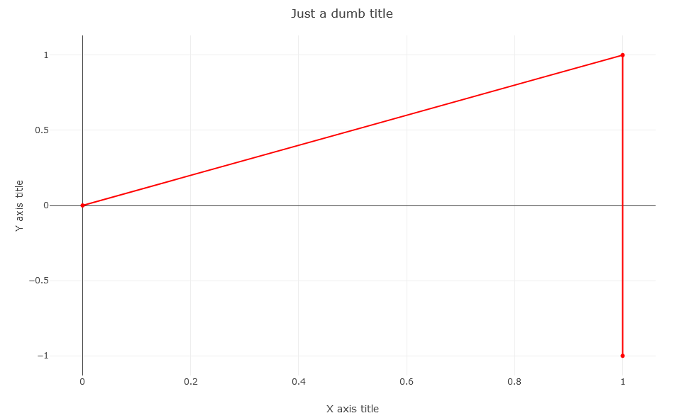

# Concept

This repository is a template for a project whose aim is to generate a standalone files (html, css, js) which displays plots just like in a dashboard. The data is fully contained in one of the js files and can be generated from R.

Hereafter is a screenshot of the result of this demo which uses [Plotly.js](https://plotly.com/javascript/) and [Golden Layout](https://golden-layout.com/). The plots can be resized and moved inside the window with drag and drop.


# Getting started

For this to work, you need to have node.js. If you don't already have it, you can get it [here](https://nodejs.org/en/download/). Using the archive (instead of the installer) does not require administrator rights, but you will have to put the path to the node executable in the PATH environment variable.

Download this template, and unzip it if it is zipped. Open a terminal and go to the root directory of the project and type `npm install` or `npm i`. It will download all the needed dependencies (they are specified in the package.json file).

# Generate data.js from R

In this demo, `data.js` is really lightweight and its structure is simple. In a real project it should be heavier and the structure more complex. You can easily create `data.js` directly with R code:
```R
library(rjson)
library(stringr)

data = list(
	"forPlot1"=list("x"=c(0,1,1), "y"=c(0,1,-1)),
	"forPlot2"=list("x"=c(0,1,2,3,3,0,3), "y"=c(0,1,1,0,-1,-3,-3)),
	"forPlot3"=list("x"=c(0,1,1,0,1,1,0), "y"=c(1,1,0,0,0,-1,-1))
)

dataToJavascript = function(data) {
	str = "!function(e,l){\"object\"==typeof exports&&\"object\"==typeof module?module.exports=l():\"function\"==typeof define&&define.amd?define([],l):\"object\"==typeof exports?exports.data=l():e.data=l()}(self,(()=>(()=>{\"use strict\";var e={d:(l,n)=>{for(var d in n)e.o(n,d)&&!e.o(l,d)&&Object.defineProperty(l,d,{enumerable:!0,get:n[d]})},o:(e,l)=>Object.prototype.hasOwnProperty.call(e,l),r:e=>{\"undefined\"!=typeof Symbol&&Symbol.toStringTag&&Object.defineProperty(e,Symbol.toStringTag,{value:\"Module\"}),Object.defineProperty(e,\"__esModule\",{value:!0})}},l={};e.r(l),e.d(l,{default:()=>n});\n\nconst n = "

	str = str_c(str, str_replace_all(toJSON(data), "\"NA\"", "null"))
	str = str_c(str, ";\n\nreturn l})()));\n")
	return(str)
}

write(dataToJavascript(data), file="data.js")
```

# Using the npm scripts and Live Server extension

When you will be modifying the project, you will certainly want to see the results quickly. You can do that by running the command `npm start` in the terminal. This way whenever you modify a .ts or .scss file in the `src` folder, the corresponding index.js will be regenerated automatically in the `public` folder.

But if you don't want to press F5 in your web browser each time after that, you can use the extension "Live Server": it will refresh the page each time one of the source file changed. Install the extension then right click on `index.html` and choose `Open with Live Server`.

Once done, press Cltr+C in the terminal and stop Live Server by clicking on the corresponding item in the status bar.

If you just want to generate the output files without "watching for the files to change", you can simply run the command `npm run build`.

# Adapt it to your needs

Here are the first steps to adapt the template to your needs:
- generate the new `data.js` file from R and put it in the `public` folder
- update `types.ts` so that it matches the structure of your data. For example:
```typescript
export type Data = {
	forPlot1: xyData;
	forPlot2: xyData;
	forPlot3: xyData;
};

export type xyData = {
	x: number[];
	y: number[];
};
```
- update `node_modules/data.ts`: it must has the same structure as `data.js` but the smaller it is the better. You can for example use empty arrays. These values will not be used, only `data.js` will be used. For example:
```typescript
import type {Data} from "../types";

const data: Data = {
	forPlot1: {x: [], y: []},
	forPlot2: {x: [], y: []},
	forPlot3: {x: [], y: []}
};

export default data;

```
- update `index.html`, `styles.scss` and `the Typescript files` to do exactly what you want for the plots. In `style.scss` you can write just standard CSS or use SASS features.
